# Procter & Gamble 🔗

## Hosted link to our website 
To explore our project, visit here [https://sheetalgithub30.github.io/P-G/](https://sheetalgithub30.github.io/P-G/)

### <u>TABLE OF CONTENT</u>

1. [INTRODUCTION](#introduction)
2. [PROJECT](#project)
3. [FEATURES](#features)
4. [TECHNOLOGIES](#technologies)
5. [INSTALLATION](#installation)
6. [CHALLENGES](#challenges)
7. [REFERENCES](#references)
8. [WEBSITE UI](#website-ui)
9. [LICENSE](#license)
10. [CONCLUSION](#conclusion)

## 📌 INTRODUCTION
<i>"Welcome to the <b>Procter & Gamble (P&G)</b> Website Clone project! This project aims to replicate the P&G official website using HTML and CSS. 

By delving into this project, you'll gain hands-on experience in building responsive web pages, implementing navigation menus, structuring content layouts, and styling elements using CSS. The project serves as a practical exercise to hone your HTML and CSS skills while offering insight into the intricacies of web development.

Throughout this README file, you'll find details on how to install and run the project locally, instructions on exploring the cloned website, guidelines for contributing to the project, and information about the project's licensing.

Let's embark on this journey to recreate the <b>Procter & Gamble</b> website together, learning and growing as web developers along the way!"</i>

## 📌 PROJECT
This project was assigned by <a href="#"><u>Geekster</u></a> as a Major Project for a team of 6 members 🎉 regarding Front-end web development.
    <ul type=none>
    <li>💡Sheetal (CAPTAIN)
    <li>💡Aman
    <li>💡Syed Mohammed Abbas
    <li>💡Uttam
    <li>💡Anjali
    <li>💡Harshit
   </ul>

🔖 It was an exciting opportunity for all of us to apply our skills and collaborate with each other to create a polished website.🌏 

## 📌 TECHNOLOGIES  

 #### 1. HTML  
<ul>HTML is a programming language which is used for structuring web Pages including headers, navigation bars, content sections, and footers. </ul>

 #### 2. CSS  
<ul>Applied for styling and layout with different CSS properties </ul>

#### 3. JAVASCRIPT 
<ul>JavaScript is a dynamic programming language that is used for web development, in web applications, for game development, and lots more. It allows you to implement dynamic features on web pages that cannot be done with only HTML and CSS.</ul>

 #### 4. FONT AWESOME 
<ul>Font Awesome is a comprehensive icon library that offers a vast selection of icons for various purposes, such as user interface design, web development and graphic design.

 #### Usage:
<ul>
<li><u>Include the CSS</u>: Add the Font Awesome CSS stylesheet to your HTML document by including a link in the section.
<li><u>Add Icons</u>: Insert icons into your HTML using the element with the appropriate class. Customize their appearance using CSS.
<li><u>Customize Icons</u>: You can modify icons' size, color, and alignment by adding extra classes and applying CSS styles.
<li><u>Explore Icons</u>: Visit the Font Awesome website or documentation to find the icons that suit your project's needs.</ul></ul>

#### 5. GOOGLE FONTS AND ICONS
<ul>Google Fonts is a free and extensive collection of web fonts that allows developers to easily integrate diverse and visually appealing fonts into their websites. With a simple inclusion of a link or stylesheet in the HTML, users can access a wide range of fonts hosted by Google.</ul>

<ul>Google Icons, on the other hand, are typically referenced from the Material Design Icons library. These are vector icons that can be easily customized and scaled for use in web and mobile applications. Developers can integrate these icons into their projects by including the appropriate link or script in the HTML.</ul>

## 📌 INSTALLATION 
To get started with this website clone, follow these steps:
<ol>
<li>Install Visual Studio Code for coding.
<li> Clone git Repository.
<li> Open Project Directory.
<li> Open VS Code.
<li> Open the project folder.
<li>Start the Application :  Open the index.html file in your web browser or use a local development server if you have one configured.
<li>The application should now be running locally rendering HTML, CSS and JavaScript.
</ol>

## 📌 CHALLENGES 
Throughout the development of our project, our team encountered various challenges and obstacles. Here, we document some of the major issues we faced:

#### 1. COMMUNICATION 
<ul>Coordinating tasks, updates, and changes among team members requires effective communication to ensure everyone is on the same page. </ul>

#### 2. CONSISTENCY 
<ul> Maintaining consistency in coding styles, naming conventions, and overall structure is crucial. </ul>

#### 3. VERSION CONTROL
<ul> Handling version control with tools like Git helps prevent conflicts and allows for collaboration, but it requires careful management to avoid code conflicts. </ul>

#### 4. BROWSER COMPATIBILITY 
<ul> Ensuring the website functions correctly across different browsers can be challenging due to varying levels of support for HTML, CSS, and JavaScript features.
 </ul>

#### 5. RESPONSIVENESS 
<ul>  Creating a responsive design that works well on different devices and screen sizes requires careful planning and testing. </ul>

#### 6. TESTING AND DEBUGGING 
<ul>Rigorous testing and debugging are necessary to identify and fix issues promptly. </ul>

## 📌 REFERENCES 
<ul type=circle>
<li>W3 Schools
</ul>

## 📌 WEBSITE UI 
## 1. HOME PAGE UI

 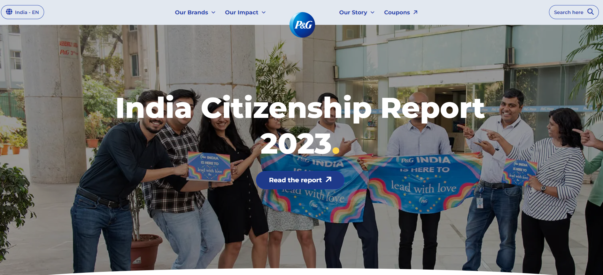
 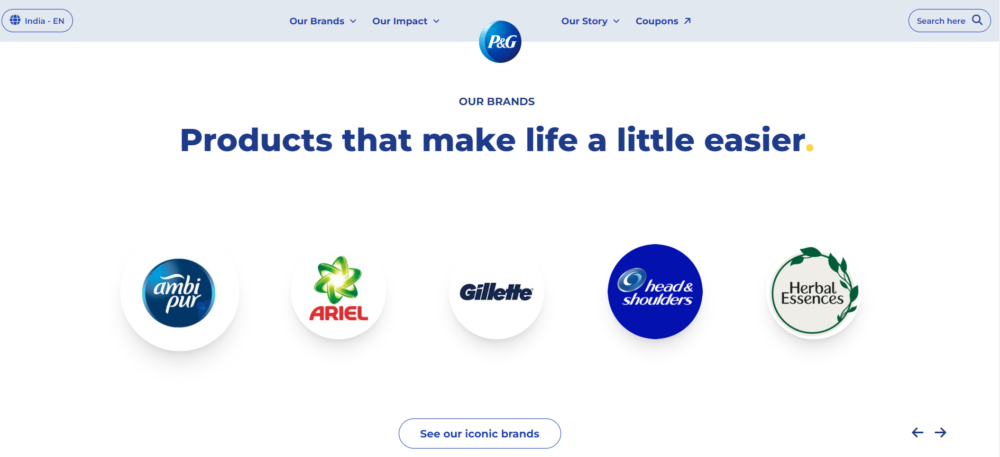
 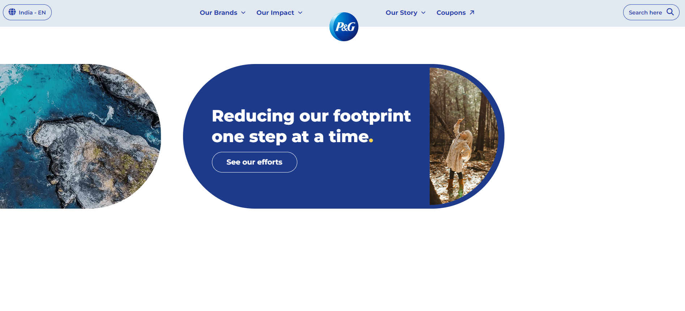
 
 

##### UI Description:<i> "The Home page is designed suct that it help users to easily access. The UI focuses on user-friendly navigation, allowing users to easily access services."</i>

## 2. BRANDS PAGE UI

 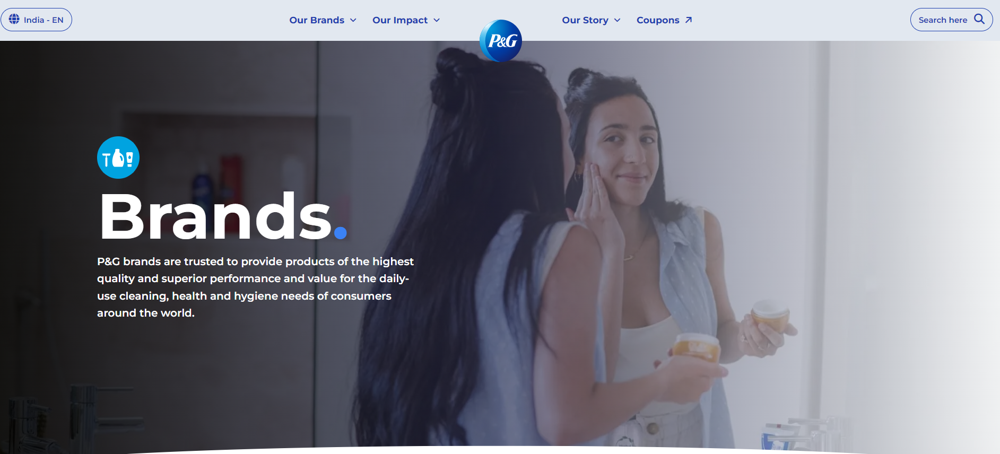
 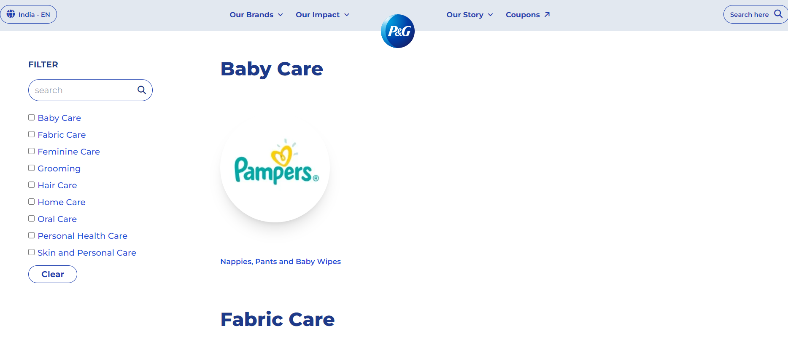
 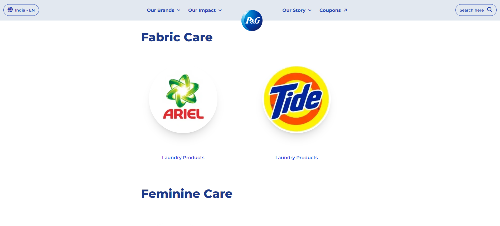
 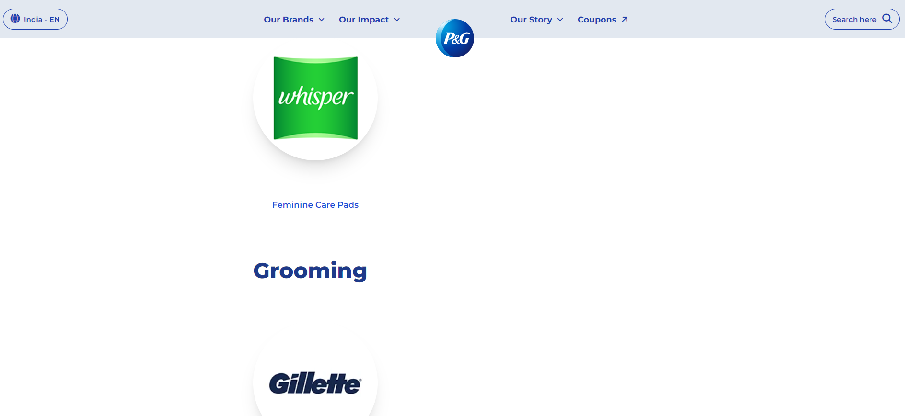
 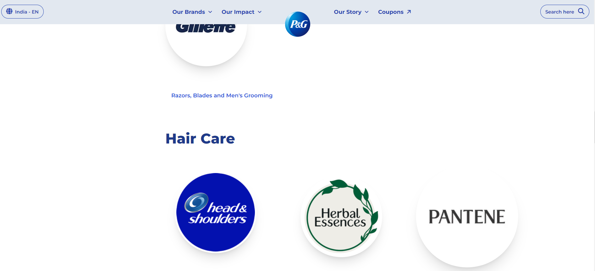
 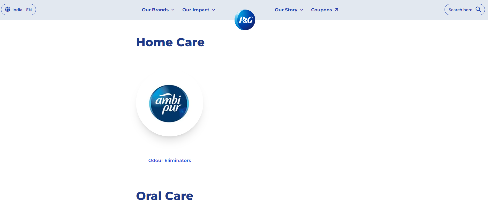
 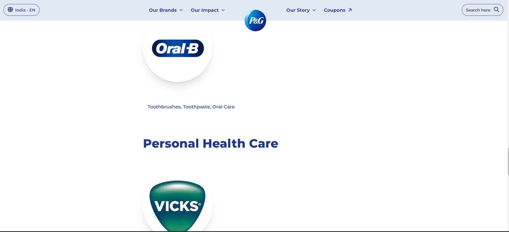
 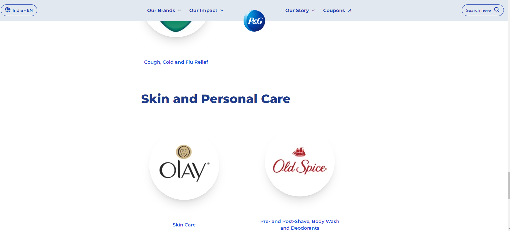
 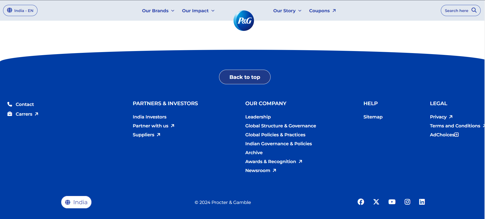

##### UI Description:<i> "The Brand page is designed such that help users to easily access through the brands name users want to purchase. The UI focuses on user-friendly navigation, allowing users to easily access services."</i>

## 3.  ETHICS & CORPORATE RESPONSIBILITY UI

 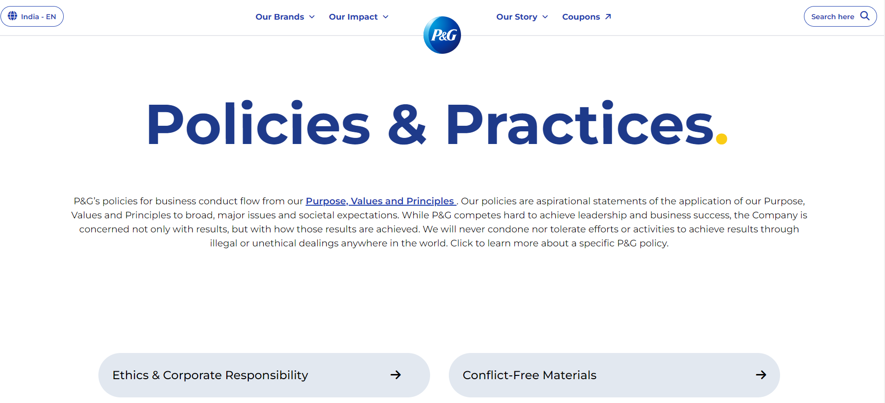
 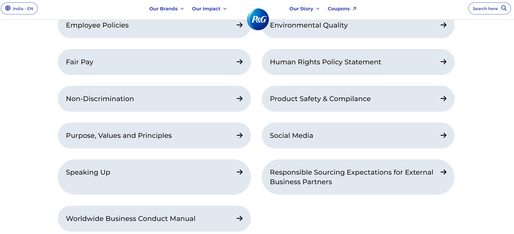
 

##### UI Description:<i> "The Ethics and corporate responibility page is designed such that help users to easily access regarding the policies of the company. The UI focuses on user-friendly navigation, allowing users to easily access services."</i>

## 3. COMMUNITY IMPACT UI

 
 
 

##### UI Description:<i> "The Community impact page is designed such that help users to easily access. The UI focuses on user-friendly navigation, allowing users to easily access services."</i>

## 4. INGREDIENTS
 
 
 
 

##### UI Description:<i> "The Ingredients page is designed such that help users to easily access. The UI focuses on user-friendly navigation, allowing users to easily access services."</i>

## 5. COUPONS

 
 
 

##### UI Description:<i> "The Coupons page is designed such that help users to easily access. The UI focuses on user-friendly navigation, allowing users to easily access services."</i>

## 📌 LICENSE
<ul type=circle>
<li>There is no license for this project as it is created under major project <b>@Geekster</b>. 
<li>You are free to use and modify the code based on your requirements.
</ul>

## ⏳CONCLUSION
In conclusion, the <b>Procter & Gamble</b> Website Clone project offers a valuable learning experience for both novice and experienced web developers alike. By recreating the layout, design, and functionality of the official <b>Procter & Gamble</b> website using HTML and CSS, developers can sharpen their skills while gaining insights into modern web development practices.

#### Achievements
<ul>
<li>Practice HTML markup for structuring content and organizing page layouts.
<li>Explore CSS styling techniques to achieve visually appealing designs and responsive layouts.
<li>Implement interactive features using JavaScript to enhance user experience and engagement.
<li>Gain familiarity with web design principles such as typography, color theory, and layout composition.
</ul>
<ul> As developers progress through this project, they not only enhance their technical skills but also cultivate a deeper understanding of the intricacies involved in crafting compelling and user-friendly web experiences. Whether used for personal skill development, portfolio enhancement, or educational purposes, the P&G Website Clone project offers a rewarding journey into the world of web development.

So, let's embark on this journey together, embracing challenges, honing skills, and celebrating the achievements along the way. Happy coding!

